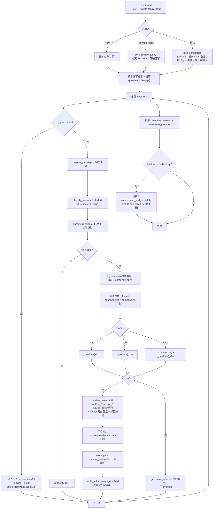
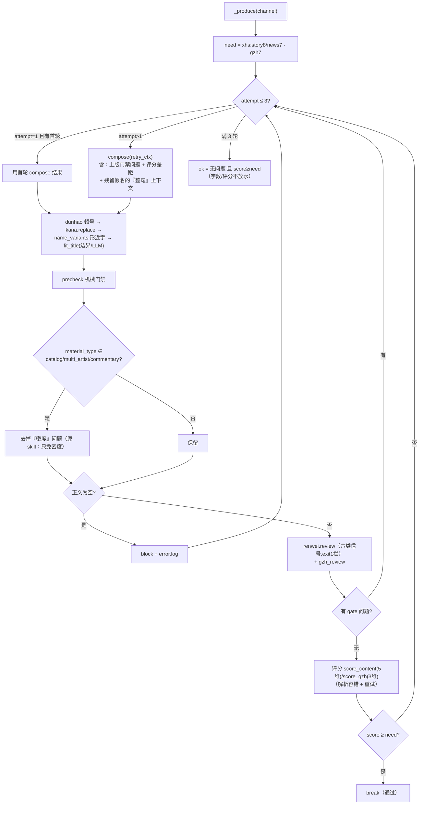
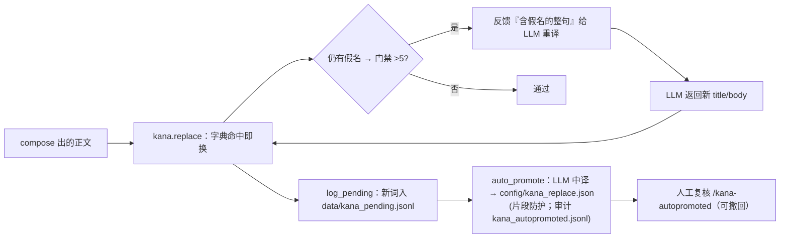

# 写稿流程（write）流程图

> 入口：`cli write-full [--key K | --rewrite-today | 默认] [--deliver] [--dry-run] [--split-large] [--split-preview]`
> 代码：`agent/write.py`（编排）、`services/*`（机械服务）、`config/*.json`（硬规则）

## 1. 主流程（run）

## 2. 单篇改稿循环（_produce）

## 3. 写前准备（prepare_package）

```mermaid
flowchart LR
  A[content_ja] --> B["截断 cap：一般 9000 / export 20000"]
  B --> C["format_route：post/export, tmin/tmax"]
  C --> D["渠道路由：channel_hint > routing.route_detail(hint+confidence)"]
  D --> E["refs=references.relevant(k=6)"]
  E --> F["patterns=feedback_patterns.relevant"]
  F --> G["同事件 cluster → merge_text(≤1200/条) + rel_candidates"]
  G --> H["同人物历史：extract_entities→related.find_related<br/>→ hist_excerpts + rel_candidates"]
  H --> I["pkg{content_ja,target,spec,merge_text,hist_excerpts,rel_candidates,...}"]
```

## 4. 假名两层

## 关键服务/配置
- 机械：`precheck` `dunhao` `kana` `name_variants` `titles` `format_route` `routing` `renwei` `gzh_review` `content_gate` `split_write`
- 数据/RAG：`references` `feedback_patterns` `related` `batches` `write_failures`
- 硬规则 config：`review_thresholds` `newfont` `kana_replace` `ja_localize` `name_variants` `adult_industry` `off_topic` `routing`
